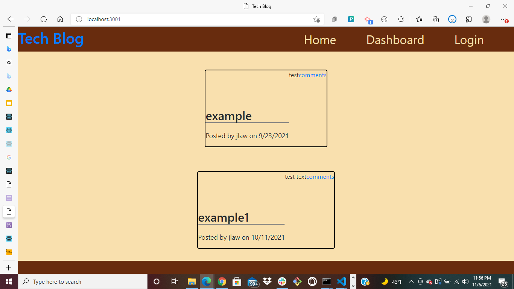
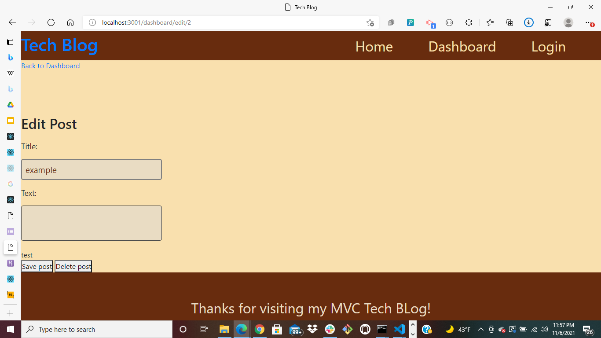
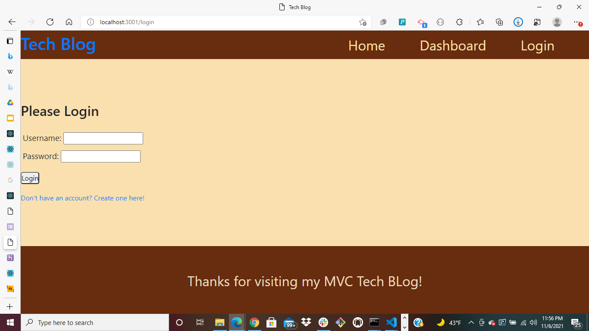

# MVC_Tech-Blog

## Table of Contents

>[Description](#Description)

>[Installation](#Installation)

>[Usage](#Walk-Through)

## Description

>Developers frequently have to create interfaces that allow non-developers to easily view and interact with information stored in databases.
>Using (CMS), this Employee Tracker app will build a command-line application from scratch to manage a company's employee database, using Node.js, Inquirer, and MySQL.
>This Employee Tracker will be able to view and manage departments, roles, and employees in a specific company

## Installation

* This application installs:
* javascript
* node
* node modules
* inquirer packages
* mysql2 packages
* table packages
* npm packages
* JSON packages
* .gitignore

## Usage 

This Employee Tracker app can be used to view employees, departments, roles within departments, and view the managers of the employees. 

# Screenshots

